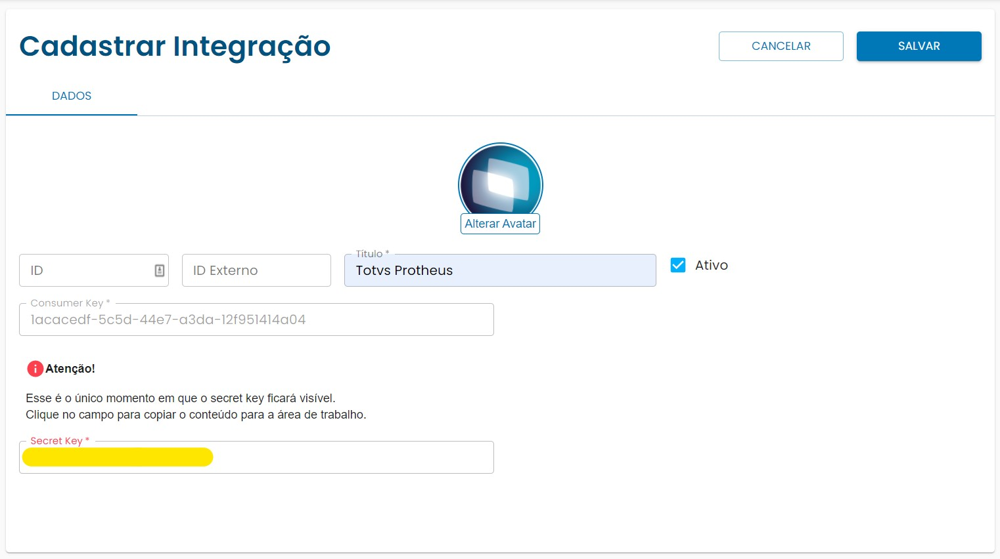

# Como obter o token de acesso

O Token de Acesso é a maneira como sua aplicação se autentica na API da plataforma Bitize e obtem todos os acessos necessários para a integração.<br>
Para iniciar esse processo é necessário criar sua chave de consumo (Consumer Key) para isso acesse a [plataforma](https://app.bitize.com.br/) como um administrador e, no menu, vá até Configurações > Integrações:
 <br>




Um ponto de atenção é que o Secret Key só é apresentado nesse momento, se você perder, será necessário criar outro cadastro de integração.

Agora que temos o consumer key e o secret key podemos fazer a requisição para obtermos o token.


<!-- theme: info -->
> ### API
> Método: POST
> 
> URL: https://api.bitize.com.io/auth
>

**JSON:**

 ```json json_schema
{
    "type": "object",
    "properties": {
        "consumer_key": {
            "type": "string",
            "description":"Chave de Consumo"
        },
        "secret_key": {
            "type": "string",
            "description": "Chave Secreta"
        },
    },
    "required": [
        "consumer_key",
        "secret_key"
    ]
}
\```


Adicione as chaves e teste abaixo:

```json http
{
  "method": "post",
  "url": "https://api.bitize.com.br/auth",
  "body":{
    "consumer_key":"",
    "secret_key":""
  },
  "headers":{
    "Content-Type":"application/json"
  }
}
```
